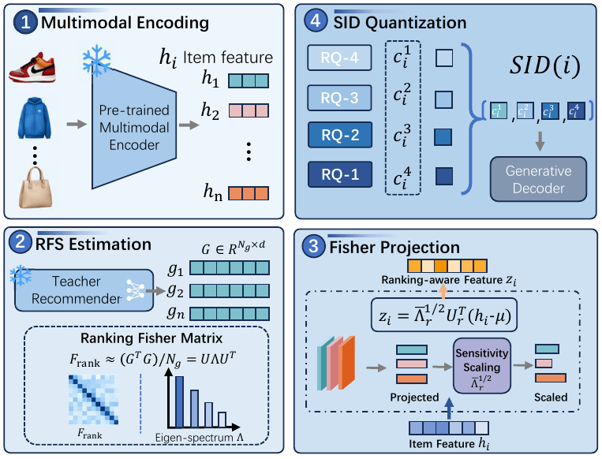

# FisherSID

Official implementation for ICASSP 2027.



This repository implements Amazon 5-core data processing, Qwen2-VL item features, a two-layer Transformer teacher, Ranking Fisher, FisherSID residual quantization, a four-level generative SID recommender, feature probes, candidate-set evaluation, baselines, multi-seed aggregation, logging, and checkpoint recovery.

## Installation

```powershell
pip install -r requirements.txt
```

## Configuration

```powershell
python scripts/init_config.py configs/beauty.json
```

Edit the data paths in `configs/beauty.json`. Copy the configuration for Sports or Clothing and update `dataset`, paths, and output directories.

## Full pipeline

```powershell
python scripts/preprocess_amazon.py configs/beauty.json
python scripts/extract_features.py configs/beauty.json
python scripts/run_experiment.py configs/beauty.json
python scripts/aggregate_results.py runs/beauty/results.json --output runs/beauty/summary.json
```

`run_experiment.py` runs:

1. Teacher training;
2. Ranking Fisher estimation on 4096 training candidates;
3. Four-level SID generation with 256 codes per level for each tokenizer;
4. Generative recommender and reconstruction probe training;
5. NDCG@10, Recall@20, KL, and Agree@10 evaluation with one positive and 1000 negatives;
6. Multi-seed result aggregation.

The default methods are `raw_rq`, `pca_rq`, `tiger`, `letter`, `mme_sid`, `musicrec`, `pit`, `fisher_rq`, and `fishersid`. Adjust the `methods` list in the configuration as needed.

Training state is stored in `runs/<dataset>/seed_<seed>/<stage>/`. Re-running the same command resumes from `*_last.pt` checkpoints.

## Core files

- `fishersid/data.py`: Data preprocessing, splitting, and sampling
- `fishersid/features.py`: Qwen2-VL feature extraction
- `fishersid/models.py`: Teacher, generative recommender, and probe
- `fishersid/fisher.py`: Ranking Fisher
- `fishersid/projection.py`: Fisher projection and eigenvalue weighting
- `fishersid/rq.py`: Residual K-Means
- `fishersid/baselines.py`: Comparison tokenizers
- `fishersid/training.py`: Training, evaluation, and checkpoints

## Validation

```powershell
python -m unittest discover -s tests -v
python scripts/reproduce_core.py
```
